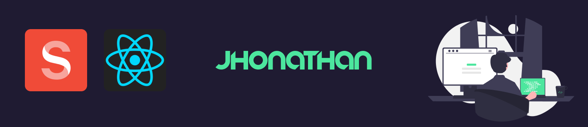

  

<h2 align="center"> Portfólio </h2>
<h3>:rocket: Projeto</h3>
<h4>Portfólio desenvolvido utilizando React para Front-end e Sanity para Back-end.</h4>

<h3>:computer: Tecnologias</h3>
<a href="https://reactjs.org">ReactJS</a> 
<a href="https://www.sanity.io">Sanity</a> 

<h3>📁 Acesso</h3>
<a href="https://jhonathan-schwitzki.netlify.app">Clique aqui!</a> 
